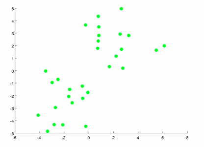
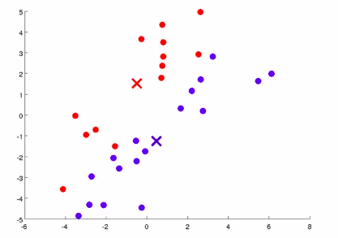
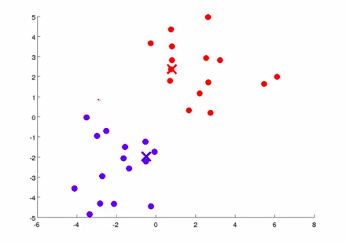
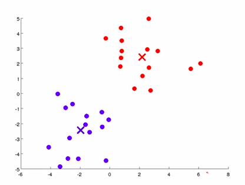
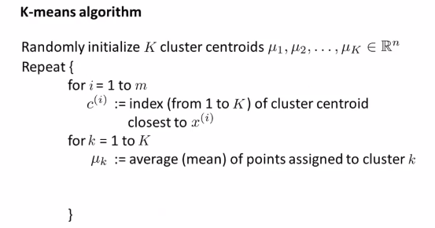
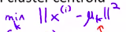

# KMeans-Clustering-for-Imagery-Analysis
Use a K-means algorithm to perform image classification
>**Through deep learning 99%+ accuracy acchieved but with kmeans that much is not achievable. My Aim was to understand kmeans clustering algorithm and high dimensional data.In deep neural n/w's, you can't visualize cluster centroids so that's why I used kmeans**

## DATASET and PREPROCESSING
The MNIST database of handwritten digits, has a training set of 60,000 examples, and a test set of 10,000 examples. The digits have been size-normalized and centered in a fixed-size image.

Dataset: http://yann.lecun.com/exdb/mnist/

**Preprocess images for clustering: converting 2D image array(array of pixel intensities:28x28) to 1D array(784x1) for ingestion by Kmeans algorithm**

The data set had 0-9 digit images, example dataset: 

- Assuming 10 be the number of clusters(for 10 digits), I fit the MiniBatchKmeans algorithm(due to large dataset, 60K x 784).
- Also KMeans being an unsupervised learning algorithm,it assigned clusters to dataset. Then I mapped each cluster number to appropriate integer number(the most common integer in the cluster because the number of cluster was just 10 and there would obviously be some misclassfications)
- Optimizing and Evaluating the Clustering Algorithm: Varied number of clusters as follows:10,16,36,64,144,256,400 and compared Inertia, Homogeneity, Accuracy. **Achieved an accuracy of 99.3 with 256 clusters adn 90% with 400 clusters but 400 clusters took much more computation time with not much increase in accuracy, so chose 256 clusters to be optimal(tradeoff)**
- Visualizing Cluster Centroids: The most representative point within each cluster is called the centroid. ***For visualization purpose, I set the number of cluster to 36***

## Kmeans CLUSTERING: An Unsupervised Learning Algorithm
In the clustering problem we are given an unlabeled data set and we would like to have an algorithm automatically group the data into coherent subsets or into coherent clusters for us.

Let's say I want to take an unlabeled data set like the one shown here, and I want to group the data into two clusters. 

The K Means clustering algorithm is an iterative algorithm:
Randomly initialize(only once) two points(because I want 2 clusters; **K centroid for K clusters**), called the cluster centroids.

1. **Cluster Assignment** : 
 
It goes through each of the examples(green dots) and depending on whether it's closer to the red cluster centroid or the blue cluster centroid, it is going to assign each of the data points to one of the two cluster centroids(color each of the points either red or blue). 
 

2. **Move Centroid Step** : take the two cluster centroids, and move them to the average of the points colored the same colour.
    - look at all the red points and compute the average(the mean of the location of all the red points),move the red cluster       centroid there. 
    - And the same things for the blue cluster centroid, look at all the blue dots and compute their mean, and then move the       blue cluster centroid there. 

 

Go back to another cluster assignment step, look at all of my unlabeled examples and depending on whether it's closer the red or the blue cluster centroid, color them either red or blue. Assign each point to one of the two cluster centroids. **And so the colors of some of the points just changed.** 
**(1)** 

And then, do another move centroid step :  Compute the average of all the blue points, compute the average of all the red points and move the cluster centroids. 
**(2)** 

**(1)** 

**(2)** 

And we are done! Kmeans has converged finding two clusters in the data.

More formally, 
 
 

Another way of writing c(i)  
 
minimize over my values of k and find the value of k that minimizes this distance between x(i) and the cluster centroid, and then, the value of k that minimizes this, gets set in c(i)  

For the move centroid step, for example: 
 

**But what if there is a cluster centroid no points with zero points assigned to it?** Just eliminate that cluster centroid and you will end up with (K - 1) clusters, **if you really need k clusters**, then the other thing you can do if you have a cluster centroid with no points assigned to it, just randomly reinitialize that cluster centroid

### Problems with non well separated clusters
We've been picturing K Means and applying it to data sets like that shown here, where we have three pretty well separated clusters, and we'd like an algorithm to find the 3 clusters for us. 
 

But it turns out that very often K Means is also applied to data sets that look like this where there may not be several very well separated clusters. Example: 

Let's say I want to design and sell t shirts of three sizes, small, medium and large. So how big should I make my small one? How big should I my medium? And how big should I make my large t-shirts. 
 

On running Kmeans,say, this clustering happens: 
 
So, even though the data, before hand it didn't seem like we had 3 well separated clusters, K Means will kind of separate out the data into multiple clusters for you.

### Optimization Objective for KMeans
K-means also has an optimization objective or a cost function that it's trying to minimize. 
Knowing what is the optimization objective of k-means:
- will help to debug the learning algorithm and make sure that k-means is running correctly. And
- use this to help k-means find better costs and avoid the local ultima.

**Notations** 
 
c(i) = index or the number of the cluster, to which an example xi is currently assigned
K = Total number of clusters

**Cost Function and Optimization Objective**
 
The cost function(called Distortion Cost Function) that k-means is minimizing is a function J of all of these parameters, c1 through cm and mu 1 through mu k that k-means is varying as the algorithm runs. 
And the optimization objective is shown to the right, the square distance between each example xi and the location of the cluster centroid to which xi has been assigned(red line).  
>**Mathematically, what the cluster assignment step is doing is exactly Minimizing J, with respect to the variables c1, c2 and so on, up to cm, while holding the cluster centroids mu 1 up to mu k, fixed. So what the cluster assignment step does is it doesn't change the cluster centroids, but what it's doing is, exactly, picking the values of c1, c2, up to cm, that minimizes the cost function, or the distortion function J => _Assign each point to a cluster centroid that is closest to it, because that's what minimizes the square of distance between the points in the cluster centroid._**  
>**The second step was the move centroid step. It can be shown mathematically that what the move centroid step does is it chooses the values of mu that minimizes J, so it minimizes the cost function J with respect to the locations of the cluster centroids mu 1 through mu k.**

***So Kmeans algorithm is taking the two sets of variables and partitioning them into two halves(c(i)'s and mui's), And what it does is it first minimizes J with respect to the variable c(i)'s and then it minimizes J with respect to the variables mui's and then it keeps iterating on.***

